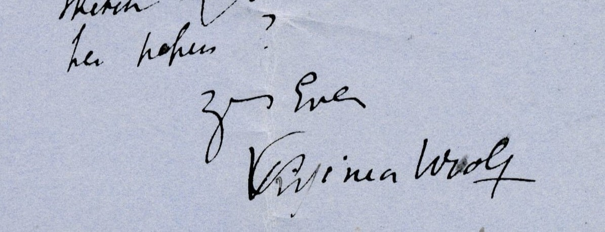

# Virginia Woolf's correspondence 💌

A corpus of 3756 letters written by Virginia Woolf between the years of 1896 and 1941. The text, dates, places and recipients were scraped from the ePUB version of *Woolf, Virginia: Complete Works* ([source](https://www.mobileread.com/forums/showthread.php?t=179482)), which collects material from volumes 1-6 of [*The Letters of Virginia Woolf*](https://www.goodreads.com/series/131039-the-letters-of-virginia-woolf) (1975-1980), and [*Virginia Woolf and Lytton Strachey Letters*](https://www.goodreads.com/book/show/532448.Virginia_Woolf_and_Lytton_Strachey_Letters) (1956).

|                       date |             recipient |                                          place | text                                              |
|---------------------------:|----------------------:|-----------------------------------------------:|---------------------------------------------------|
|          [mid-August 1926] | Edward Sackville West |                [Monk’s House, Rodmell, Sussex] | Dear Eddy,\nI have several times taken up the ... |
|         [27 November 1929] |         Daphne Sanger |                       52 Tavistock Sqre, W.C.1 | My dear Daphne,\nI am so distressed to hear of... |
|            16th April 1923 |             Roger Fry |                                Murcia, [Spain] | My dear Roger,\nThis is an invitation from Bre... |
|          [10? August 1922] | Lady Ottoline Morrell |                [Monk’s House] Rodmell [Sussex] | My dear Ottoline,\nI have sent the form to Llo... |
|               27th Nov. 37 |  Denys Kilham Roberts |                    52 Tavistock Square, W.C.1. | Dear Mr Kilham Roberts,\nThank you very much f... |
| Friday [24 September 1937] |          Vanessa Bell |                [Monk’s House, Rodmell, Sussex] | I didn’t come to tea today,—not that you proba... |
|         [23? January 1923] |      Violet Dickinson | Hogarth House, Paradise Road, Richmond, Surrey | My Violet,\nYou are the most faithful of subsc... |

The entire set is in `vw.csv` (normal comma-separated, strings escaped by `"` when necessary.)

## Pre-processing
The only pre-processing I did on the raw text was to adjust whitespace and line breaks; the letters resulting from scraping the book had extra misplaced line breaks so I cleaned them and left only those in between paragraphs. If you don't need these either, just remove all `\n`.

I also edited the recipients because they were all written as "To Vanessa Bell", for example, so I removed `"To "` and left only the person's names. Mind you that Virginia wrote them as she wanted so there might be variation in how she referred to the same person in a few cases.

### Dates

The dates in which the letters were written/sent are also recorded in various formats. Since I wanted to standardize at least the years for my work, I wrote a function to extract them as best as I could, using [dateparser](https://dateparser.readthedocs.io/) and regular expressions. This code can be found in the notebook `extract_years.ipynb` and the final version with the "year" column is in `vw_with_years.csv`. I uploaded it as a separate file because I haven't manually validated all of the rows so I can't guarantee 100% accuracy.
